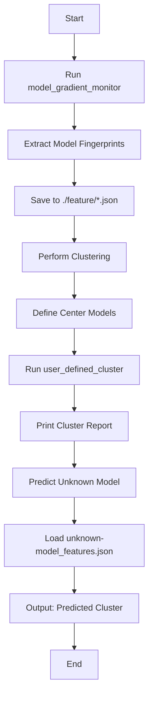

# TensorGuard: Gradient-Based Model Fingerprinting for LLM Similarity Detection and Family Classification

## Overview


This repository contains the implementation of a novel approach for Large Language Model (LLM) similarity detection and family classification using gradient-based fingerprinting techniques. Our method extracts unique fingerprints from LLMs by analyzing their gradient responses to various perturbations, enabling effective model clustering and classification.

## Key Features

- **Gradient-Based Fingerprinting**: Extract unique model signatures through gradient response analysis
- **Multi-Perturbation Analysis**: Support for adversarial, structured, Gaussian, low-frequency, and high-frequency perturbations
- **User-Defined Clustering**: Custom clustering with user-specified model centers
- **Model Family Classification**: Automatic detection of model relationships and families

## Architecture

### Core Components

1. **Model Gradient Monitor**: Core class for gradient extraction and feature analysis
2. **Feature Extraction**: Rich feature sets including statistical, frequency-domain, and structural features
3. **Clustering Algorithms**: Multiple clustering methods for model family detection
4. **Unknown Model Prediction**: Family classification for unknown models

<!-- ## Installation

```bash
# Clone the repository
git clone <repository-url>
cd cluster_feature

# Install required dependencies
pip install -r requirements.txt
``` -->

## Usage

### 1. Extract Model Fingerprints

Use this function in model_gradient_monitor.py

```python
if __name__ == "__main__":
    # Replace the models to generate model fingerprints
    model_paths = ["path/to/model_1.safetensors", "path/to/model_2.safetensors"]
    
    debug_model_analysis(model_paths, num_samples=15)
```

### 2. Perform Model Clustering & Predict Unknown Model Classification

Use this function in user_defined_cluster.py

```python
if __name__ == "__main__":
    feature_directory = "./feature"
    
    # Initialize the cluster centroids
    center_models = ["gemma-3-4b-it", "Llama-3.1-8B", "llama-3.2-1b", "Llama-3.2-3B", "Mistral-7B-v0.1", "phi-4", "Qwen2.5-3B", "Qwen2.5-7B-Instruct"]

    results = cluster_from_files_with_centers([feature_directory], center_models)
    
    if results:
        print_cluster_report(results)
    
    # Replace the unknown model fingerprint for family classification
    unknown_model_file = "unknown-model_features.json" 
    prediction = predict_unknown_model_cluster(unknown_model_file, cluster_results=results)
```

## Analysis

Analyze model layer's sensitivity for different noises. 

Use this function in model_sensitivity_analyzer.py

```python
if __name__ == "__main__":
    # Single Model
    # model_path = "path/to/model.safetensors"
    # analyze_model_sensitivity(model_path, num_samples=20, output_dir="sensitivity")
    
    # Multi Models
    # model_paths = ["path/to/model_1.safetensors", "path/to/model_2.safetensors"]
    # compare_model_sensitivities(model_paths, num_samples=30, output_dir="sensitivity")

    # Test the attention perturbation scheme
    model_path = "path/to/model.safetensors"
    test_attention_perturbation(model_path, num_samples=30)
```

## File Structure

```
cluster_feature/
├── model_gradient_monitor.py    # Core gradient analysis
├── user_defined_cluster.py      # Clustering implementations
├── model_analysis_utils.py      # Additional analysis utilities
├── features/                    # Extracted model features
├── imgs/                        # Generated visualizations
└── models/                      # Model storage directory
└── sensitivity/                 # Sensitivity visualizations
```

# Model Fingerprinting & Clustering Workflow




## Performance Considerations

- **Batch Processing**: Efficient processing of multiple models
- **Scalability**: Optimized for large-scale model comparison
- **Device Support**: CUDA GPU acceleration support

## Applications

- **Model Family Detection**: Identify relationships between different LLMs
- **Similarity Analysis**: Quantify similarity between model architectures
- **Model Verification**: Detect model variants and derivatives
- **Research Analysis**: Study model evolution and development patterns

## Citation

If you use this code in your research, please cite our paper:

```bibtex
@misc{wu2025gradientbasedmodelfingerprintingllm,
      title={Gradient-Based Model Fingerprinting for LLM Similarity Detection and Family Classification}, 
      author={Zehao Wu and Yanjie Zhao and Haoyu Wang},
      year={2025},
      eprint={2506.01631},
      archivePrefix={arXiv},
      primaryClass={cs.LG},
      url={https://arxiv.org/abs/2506.01631}, 
}
```

## License

This project is licensed under the Apache 2.0 License - see the LICENSE file for details.

## Contributing & Contact

We welcome contributions! Please feel free to submit pull requests or open issues for bugs and feature requests. For questions and support, please contact wuzehao195@hust.edu.cn.
